# ARCHITECTURE OF GRACE
# THE STUDIO — ELITE PRODUCT HANDOFF
# Written 2026-10-08. Replaces the product brief that treated the rooms as a blank canvas.
# Drawings added 2026-10-09 (§00b). What shipped since it was written: §33.

READ THIS FIRST

You are not being asked to add more features.
You are not being asked to polish seven pages.
You are being asked to take an already ambitious, functioning collection of interactive music rooms and turn them into one product.

The site is static. It lives in `aog-deploy/`. Netlify publishes that folder from `main`. There is no build step for the site itself. Some music pages are generated; never edit the built copies.

Before you touch a file, read, in this order:

1. `CLAUDE.md` at the repo root. Its standing orders apply to every page you touch.
2. `music-handoff/HANDOFF.md`. How the music bench fits together, the shelves, the tests, the deploy.
3. `music-handoff/LANDSCAPE-HANDOFF.md`. Sideways play views. Do not regress them.
4. This file.

Start from `main`. Do not re-merge the old `origin/claude/amp-*` branches. They are a record.

The objective is:

PRESERVE THE SOUL. SIMPLIFY THE PATH. RAISE THE CEILING.

Approach the work as though it were being reviewed by the top 1% of professionals in product design, interaction design, UX architecture, visual design, frontend engineering, music technology, educational technology, accessibility, and creative direction.

Do not optimize for "good enough."
Do not optimize for "looks polished."
Optimize for the strongest possible version of what this product already is.

---

## 00 — WHAT ALREADY EXISTS. DO NOT REDISCOVER IT.

The live site is https://architectureofgrace.org/

These are distinct rooms, not sketches. Each already has its own engine, lessons, recorder, and sideways or touch behavior.

| Room | File | Live route | Role today |
|---|---|---|---|
| Drum Machine | `aog-deploy/music-pads.html` | `/drum-machine` | The instrument. SP-1200-style pads, grid, kits, swing, Sound dial. The old machine (`music-drums.html`) is retired. `/drums`, `/classic-drum-machine`, and `music-drums.html` redirect here. Never link to the classic machine. |
| Drum Kit | `aog-deploy/music-kit.html` | `/drum-kit`, `/kit` | Its own room. Recorded kits only, drawn as a kit, played clean at 44.1 kHz. Not a view of the Drum Machine. |
| Piano | `aog-deploy/music-piano.html` | `/piano` | Keys, 34 sounds, chord patterns, lessons. Hand-written except lessons. |
| Guitar | generated | `/guitar` | Source is `aog-deploy/_work/music/strings_page.html`. Run `python3 make_strings.py` in that folder. Never edit `music-guitar.html`. |
| Bass | generated from the same source | `/bass` | `GTR` false. Not "guitar with fewer strings." Never edit `music-bass.html`. |
| Band | generated | `/band` | Sources: `_work/music/band_head.html` + `band_script.js`, then `make_band.py`. Never edit `music-band.html`. |
| Turntables | `aog-deploy/music-decks.html` | `/turntables` | Three decks, mixer, crate, vinyl worklet. |
| Mixing Desk | `aog-deploy/music-studio.html` | `/studio` AND `/mixing-desk` | Eight tracks, sends, master, bounce. This is the desk, not a shell. |

Lab doors already cross the top of every music room (`aog-labdoors.js`). Order is song order and is not negotiable:

Drum Machine, Drum Kit, Piano, Guitar, Bass, Band, Turntables, Mixing Desk.

A new music room joins `LABS` there and loads the script. Menus that list the rooms use the same order.

The project connective tissue already exists. It is not navigation. It is IndexedDB, in `aog-handoff.js`:

- `drumbench` — drum machine bounce
- `keysbench` — piano
- `guitarbench`, `bassbench`, `bandbench`
- `drumtake` — a take from the drum machine recorder
- `chordpads`
- `drumsample` — a take from any tool, for a drum pad
- `studioinbox` — a LIST, not a shelf. Takes sent to the desk. Newest first. At most 16. The 17th pushes out the oldest.
- `studiobench` — the desk's bounce, which the turntables can load

`aog-recorder.js` already records on piano, guitar, bass, band, and drum machine (the tool's own sound, never a microphone, 3 takes). Each take can Save as .wav, Send to the turntables, Send to the drum machine, Send to the Studio. The turntables keep their own Record, with Send to the Studio.

Loudness standard, do not move it: a C major chord rendered offline through the page's own chain before the compressor, K-weighted, loudest 400 ms, is −8.62 dB. Every sound on every tool stays within ±0.5 dB of that.

On screen, sounds are named by style and feel, never by band or player. The inspiration stays in code comments.

## 00b — THE DRAWINGS. THEY ARE THE LOOK.

Jimmy drew the rooms and the faces of the instruments in pencil (2026-10-08). Where he made more than one version, the pick is below and the other is kept beside it, marked "alt".

### The rooms (live)

All eight room banners come from one sheet, "The Music Rooms" (`art/drawings/the-music-rooms.jpg`). One hand drew every room, so the lab doors read as one set. Each banner is in `aog-deploy/img/banners/music-<room>-pencil-{900.jpg,900.webp,1600.webp}`. The masthead, the lab doors (`aog-labdoors.js`), the Explore menu and `/the-studio` all use these files. The drawing sits 60% across the banner, inside the window the lab doors show (a 4:3 crop at 68%).

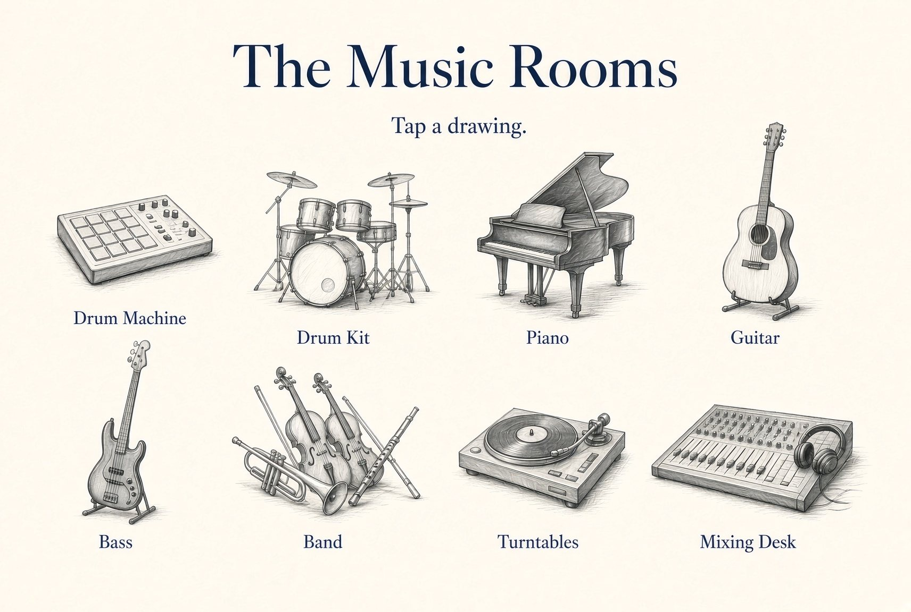

| Drum Machine | Drum Kit | Piano | Guitar |
|---|---|---|---|
| 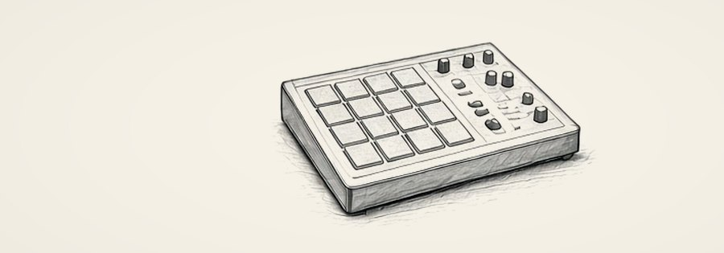 | 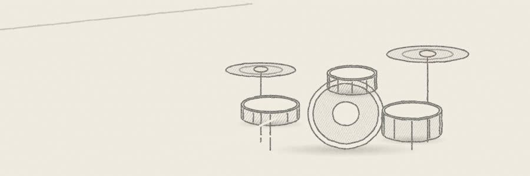 | 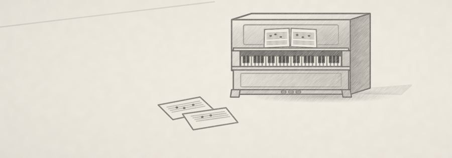 |  |
| **Bass** | **Band** | **Turntables** | **Mixing Desk** |
|  | 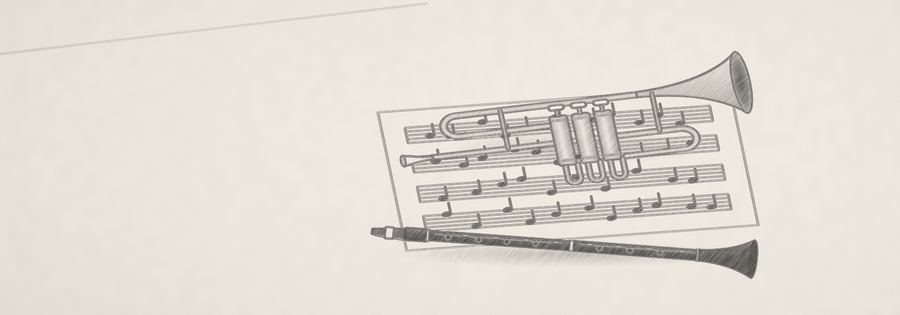 | 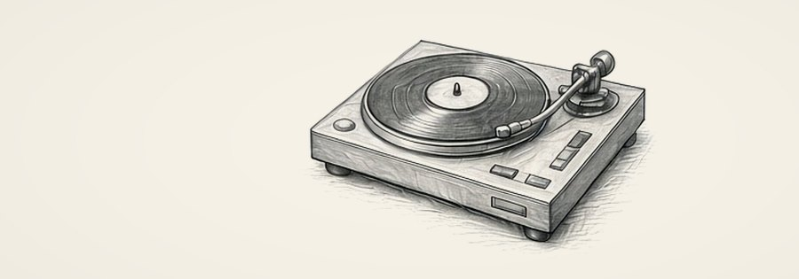 | 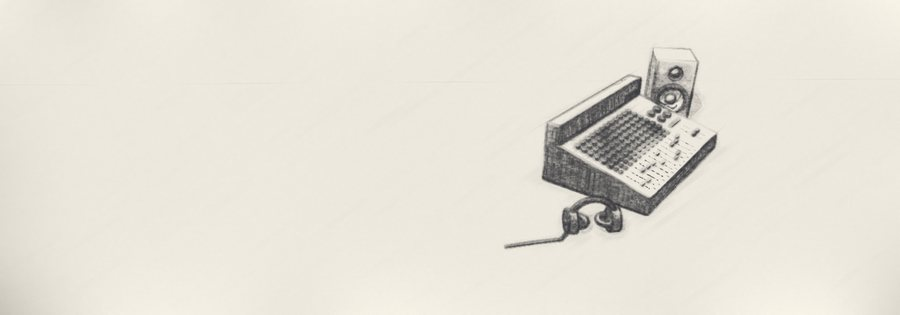 |

The Studio's own door (the Explore menu, `music-studio-pencil-*`) is the console with a speaker and headphones: the control room of the house.

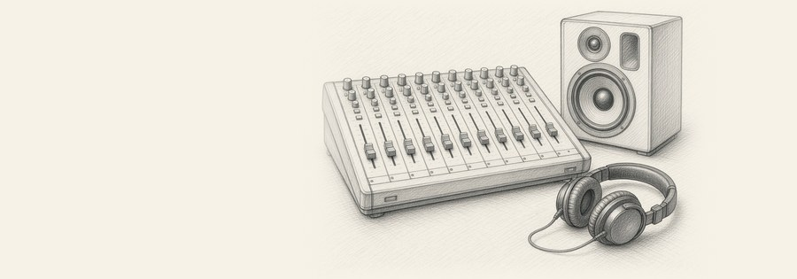

To remake a banner: crop the drawing from its sheet and multiply it onto paper `#F6F2E8`, the drawing about 84% of the banner's height and at most 46% of its width. Keep the three sizes and the names. Bump `sw.js`.

### The faces of the rooms (mockups, the direction for §05–§10)

These show the first surface of each room: the drawing at the top right, the title, one dark chassis with the instrument as the hero, and one plain line on a paper slip. They are the direction, not a pixel spec. The words on them still follow `CLAUDE.md` (plain words, English and Spanish). The approved Mixing Desk face in §10 wins over its mockup.

| Drum Machine | Piano |
|---|---|
| 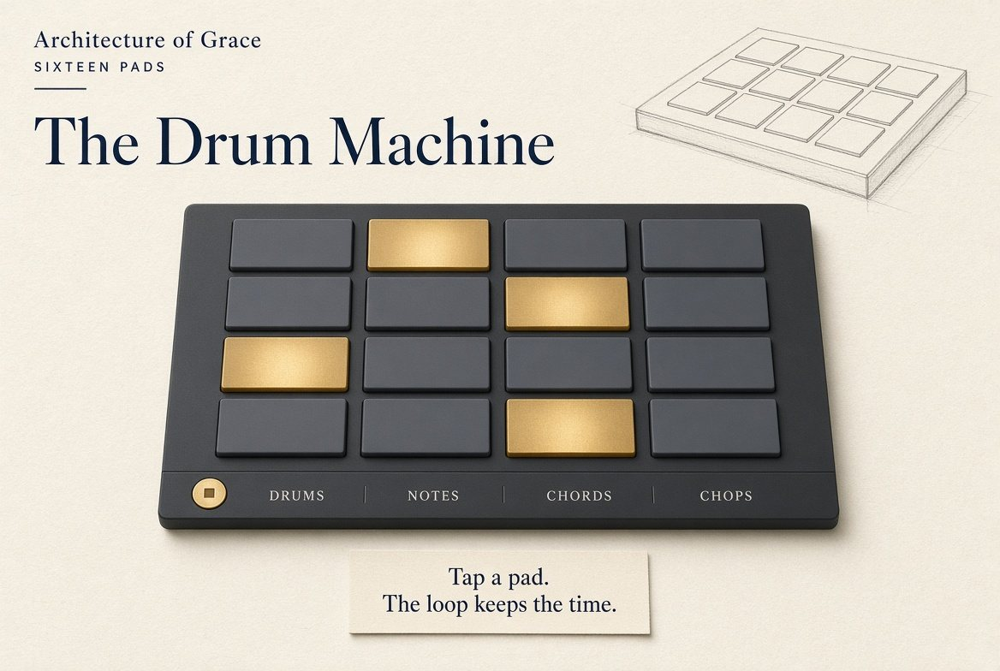 | 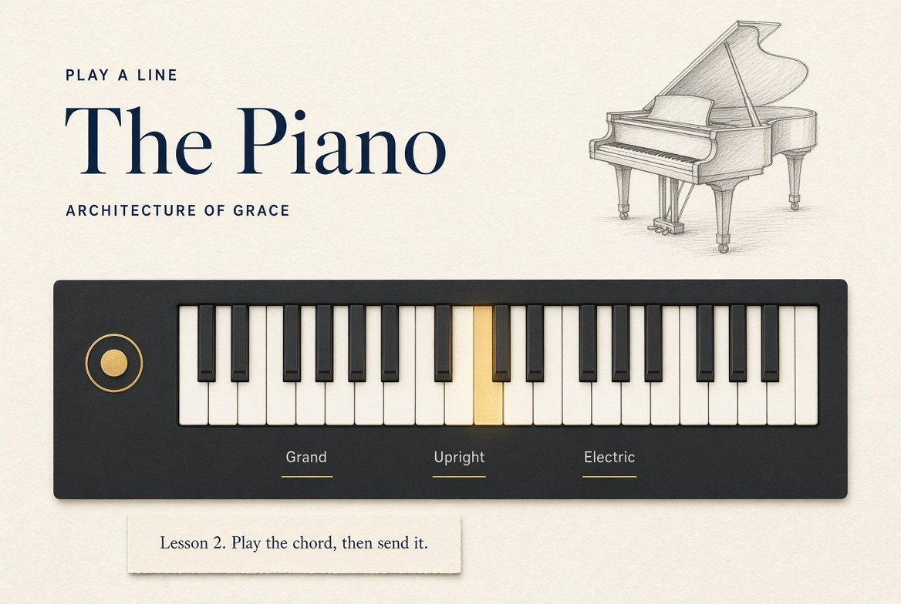 |
| **Guitar** | **Bass** |
| 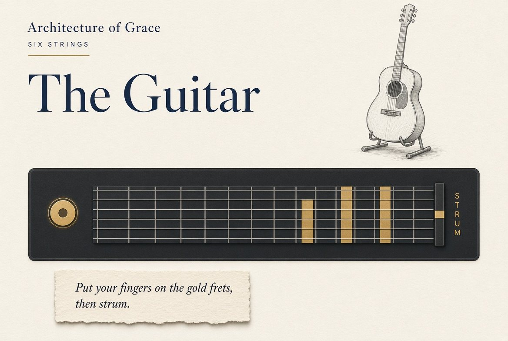 | 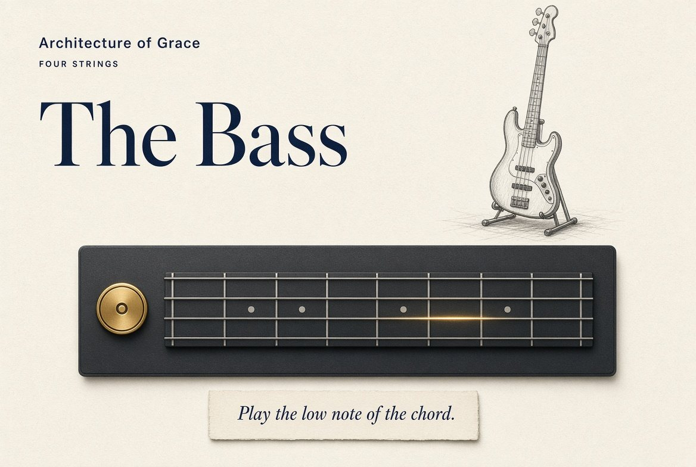 |
| **Band** | **Mixing Desk** |
| 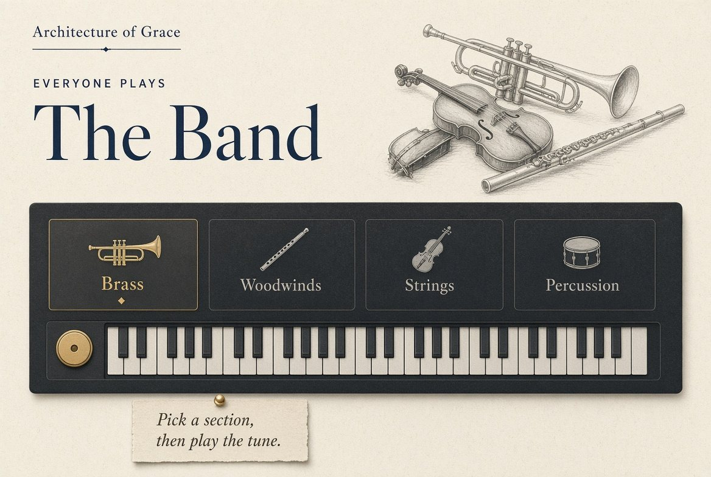 | 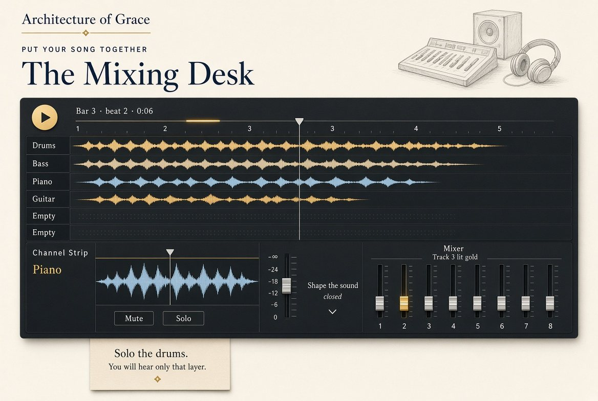 |

Why these picks:
- **Guitar:** the gold fret bars and the Strum strip show what to do. The alt (`art/mockups/guitar-alt-record.jpg`) puts a ▶ play triangle on the Record button, which reads as Play.
- **Bass:** only the fretboard and one line on the first surface. The alt (`art/mockups/bass-alt-amp.jpg`) puts five amp knobs beside it. §08 keeps the amp one step away.

### Spare drawings

Kept for later pages and print; not on the site yet.

| | |
|---|---|
| 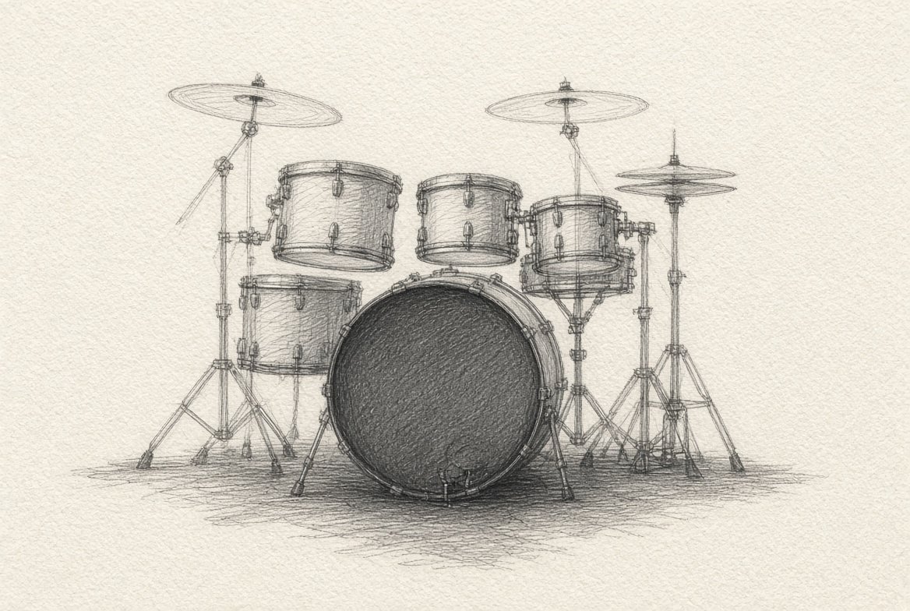 | 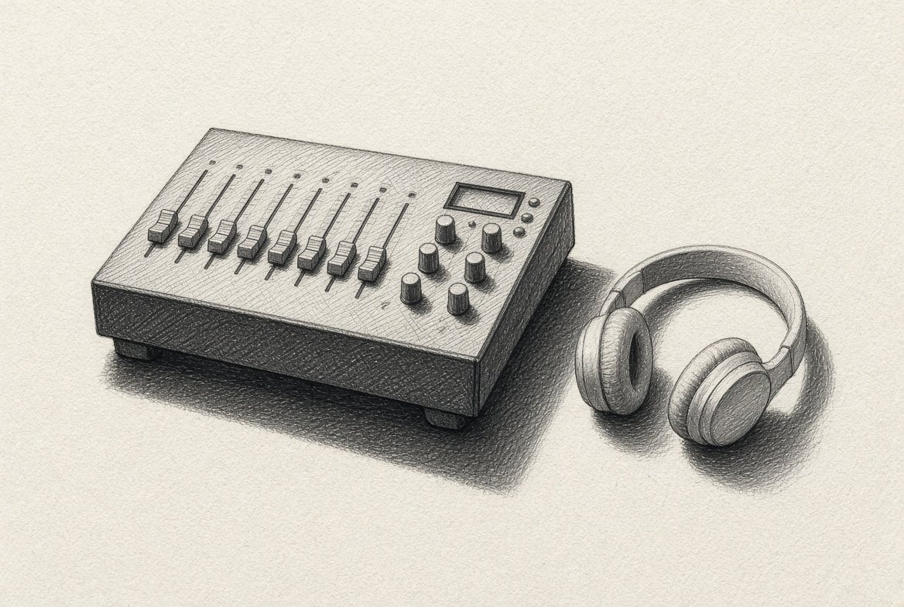 |
| 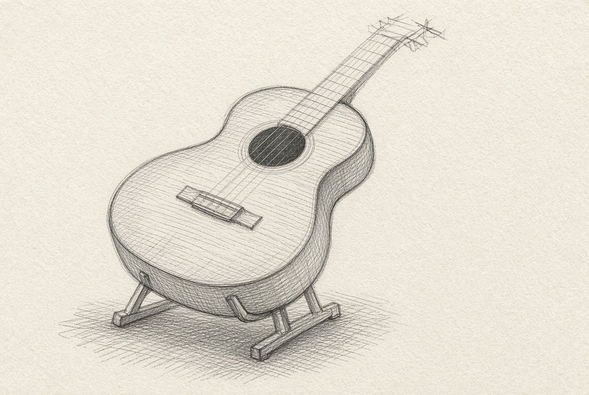 | 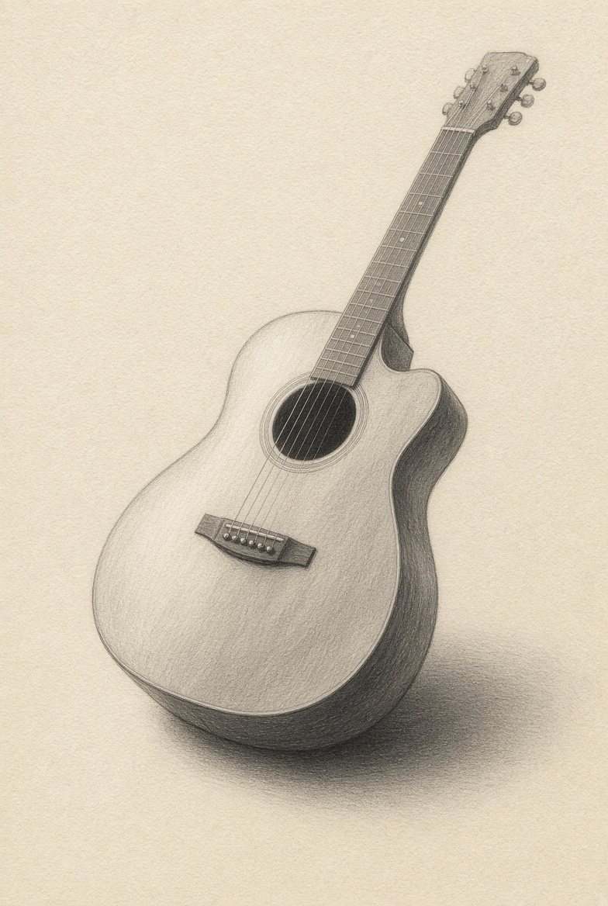 |

---

## 01 — THE PRODUCT YOU ARE ACTUALLY BUILDING

The Studio is Jimmy's instrument first. He is a musician and a maker who wants to play, chop his own records, add his voice, plug in his real guitar, mix, and send the result out. Students and children are not the design center. A learner can still use a room. Do not simplify the ceiling, the language, or the signal path to make it feel like a classroom activity.

Write the interface for a person making music. Not for a class completing one. No learning objectives on the surface. No "student should." Say "you."

The public aim is word of mouth, not a campaign. The Studio should be the best free recording studio a person can stumble into from a link a friend sent. No account. No trial. No email gate. One address. You play, you record, you leave with a file. That is what gets told to the next person. Do not build a growth funnel. The work is the marketing.

The product is:

THE STUDIO

A creative environment inside Architecture of Grace where you can:

PLAY → MAKE → PLUG IN → ADD A LAYER → LISTEN → CHANGE → MIX → SEND IT OUT

The instruments are the rooms.
The Studio is the house.
The Mixing Desk is the control room, not the house.

The user should understand that distinction immediately.

---

## 02 — THE CORE PRODUCT IDEA

One world.
Eight rooms.
One project.
One consistent interaction philosophy.

The Studio should feel like a place you can enter and think:

"I can make something here."

Not: "Which educational activity am I supposed to complete?"
Not: "Which webpage am I on?"
Not: "What does all of this software do?"

Exploration first. Explanation second.

---

## 03 — DO NOT EXPAND THE PRODUCT

This is a coherence phase, not an expansion phase.

Do not begin by adding instruments, effects, lessons, controls, kits, or decorative elements.

The existing system is already rich enough. The next increase in value comes from integration, hierarchy, clarity, and flow.

Before anything new is added, ask: does this materially improve the experience of creating music? If not, do not build it.

Explicit exceptions Jimmy asked for, already in scope: a voice slot, chops from his own records onto the Drum Machine, Send it out, and a real guitar into the desk. Do not treat those as expansion. Build them.

---

## 04 — THE PRIMARY ARCHITECTURAL MOVE

Create one Studio shell.

Route decision, already made. Do not reopen it:

- `/the-studio` is the new flagship shell.
- `/studio` and `/mixing-desk` stay the Mixing Desk until a later, explicit redirect migration. Both currently serve `music-studio.html`. Internal names (`studioinbox`, `studiobench`, `AOG-STUDIO-*`, the `studio/` tests) stay.
- Existing room routes stay live and bookmarkable:

```
/drum-machine
/drum-kit
/guitar
/bass
/piano
/band
/turntables
/mixing-desk
/studio          ← still the desk, for now
```

From the shell, those routes should feel like changing rooms, not leaving the product. Implement that as a persistent shell with the active room as the workspace. A direct hit on `/bass` may keep serving the bass page in this phase, but the shell, the lab doors, and the project strip must make it feel like the same house. Do not break existing links to buy a cleaner URL.

Do not collapse eight audio graphs into one mega-page in this phase. A unified Studio means one coherent environment that reveals the right room. It does not mean every control from every page on one screen.

Generated pages stay generated. If you must change guitar, bass, or band, edit the source and regenerate.

---

## 05 — THE STUDIO SHELL

One persistent frame.

```
ARCHITECTURE OF GRACE

THE STUDIO
Play · Make · Listen · Change · Mix

DRUMS   KIT   PIANO   GUITAR   BASS   BAND   TURNTABLES   MIX
────────────────────────────────────────────────────────────

                    ACTIVE ROOM

                 [CURRENT INSTRUMENT]

────────────────────────────────────────────────────────────

MY TRACK
Drums —   Kit —   Piano —   Guitar —   Bass —   Band —   Turntables —   Voice —
Live guitar —   Live bass —
```

The exact visual treatment is yours. The principle is not:

Switching instruments feels like changing instruments inside one studio, not navigating to another website.

The shell is shared. The rooms are not clones.

Lab doors remain the way a student moves. Do not replace them with a wall of tabs. `CLAUDE.md` already forbids a row of four or more section choices as buttons, with the music lab doors as the explicit exception.

---

## 06 — ONE PROJECT: MY TRACK

This is the most important conceptual upgrade.

The maker is not independently using eight tools. They are building one thing: My Track.

Possible layers, in song order:

Drums, Drum Kit, Piano, Guitar, Bass, Band, Turntables, Voice, then Mix.

Bind My Track to the shelves that already exist. Do not invent a second save system.

What a checkmark means, exactly:

- A layer is present when that room has a take in `studioinbox`, or a bounce on its shelf that the desk can load.
- Visiting a room does not check the layer.
- "Add a layer" sends the current take through the existing Send path, then returns the student to the project, not to a new website.
- The desk reads `studioinbox` as it does now. Newest first. Cap 16. Do not silently drop a take without naming what was pushed out.

The purpose of every room becomes obvious: I am adding a piece to something I am making.

---

## 07 — THE UNIVERSAL USER JOURNEY

This path should feel natural. It matters more than any button.

PLAY — touch the instrument.
MAKE — a pattern, a part, a progression, a performance.
ADD A LAYER — bring it into My Track.
LISTEN — hear what you have.
CHANGE — revise.
MIX — open the control room.
SAVE — keep the creation.

A student should never feel they are navigating a technology stack.

---

## 08 — PROGRESSIVE DISCLOSURE

Do not remove sophisticated functionality. Control what is visible when.

A student opening a room sees the creative surface first.

```
PLAY        the instrument
BUILD       pattern / chords / sequence
ADVANCED    deeper controls, one disclosure away
LEARN       optional, closed by default
```

Controls differ by room. The mental model does not.

Simple to enter. Deep to explore.

The amp, pedals, EQ, Solo mode, swing, Sound dial, kit menus, and deck pads stay. They do not sit on the first surface at equal weight.

---

## 09 — EACH ROOM KEEPS A DISTINCT ROLE

Same building. Different rooms.

DRUM MACHINE — rhythm, percussion, sequencing.
The pad and the grid stay highly prominent. Tap a sound. Build a pattern. Change it. Add it to the track. Do not bury the pads under controls. This is `music-pads.html`, not the retired machine.

DRUM KIT — a kit you play with your hands.
Its own room. Recorded kits, drawn as kits. Do not fold it back into the Drum Machine.

GUITAR — instrument, expression, tone.
It should feel like something someone wants to play. Amp and pedals support that. They do not lead.

BASS — groove, foundation, low end.
Not a smaller guitar. The relationship to rhythm should be obvious in the playing, not in a caption.

PIANO — harmony, melody, keys, sound palette.
Playing first. Sound choice and advanced controls behind that.

BAND — harmony, composition, musical structure.
Do not flatten chords, keys, progressions, scales, or arrangement. Make an accessible entry into them. Sophistication stays discoverable.

TURNTABLES — performance, manipulation, DJ workflow.
Tactile. The path is load → play → cue → chop → manipulate → loop → mix. Three decks stay. Sophisticated is allowed. Confusing is not.

A student can load their own record. From that record they can cut chops. Those chops are not trapped on the decks.

BRING CHOPS TO THE DRUM MACHINE — required path, not a later idea.

The move is: I cut this from my record. Put it on the pads.

- On the Turntables, after a chop or a take is made from the student's own record, the next action is visible: Send chops to the Drum Machine.
- "Own record" means a file the student loaded on this device. It stays on this device. Nothing is uploaded to make the chop.
- The chop arrives on the Drum Machine's chops bank, ready to hit, not in a file picker and not on the retired machine.
- Use the path that already exists. A take goes to `studioinbox` (where the Drum Machine already finds takes to chop) and a note on `padstake` tells the Drum Machine to put it on the chops bank. Do not invent a second sample bus. `drumsample` remains the shelf for a take sent onto one pad.
- Sixteen chops is the existing cut: one beat each from the bar picked, or sixteen equal parts when tempo is unknown. Keep that. A single chop the student marked can also land on one pad.
- Name the chop after the record, in plain words. The student can rename it.
- Sending does not leave the Studio. After the send, the student can open the Drum Machine with that chops bank already in front of them.
- The pads stay the first surface. A new chop does not bury the kit under an import panel.

MIXING DESK — production, arrangement, balance. The control room.
Its job is: what did I make, and how do I bring it together?
It is the destination, not another instrument.

---

## 10 — THE MIXING DESK IS A DESTINATION

Do not treat it as another instrument page, and do not redesign the face that was already approved.

Approved face, non-negotiable:

- Cream paper.
- Pencil console drawing as the banner.
- One dark chassis.
- Song lanes with waveforms as the hero.
- One open channel.
- Eight short faders.
- The lesson as a paper slip.
- The phone mock that drifted is not the spec.

Mental model:

```
CONTROL ROOM
Your track is here.

01 DRUMS
02 KIT
03 PIANO
04 GUITAR
05 BASS
06 BAND
07 TURNTABLES
08 VOICE
```

Track 08 is the voice slot. It is empty until the student adds a voice. It is not a spare instrument channel and not a hidden bus.

What "add voice" means:

- The student chooses it. The microphone never opens on load, on play, or in the background.
- First use asks for the microphone in plain language, English and Spanish: "To add your voice, this page needs the microphone. The recording stays on this device."
- A take is the student's voice only, captured after an explicit Record. Stop ends it. Delete works the same way as other takes, including Bring it back until the next delete.
- The take lands in My Track on channel 08 and in the same local save as other layers. It does not upload. There is no account and no backend in this phase.
- Listen plays it with the other layers. Mix can level it, mute it, and solo it like any other channel.
- If the browser or the school device refuses the microphone, the slot stays, with a plain line and a way to try again. The rest of the Studio still works.
- School-device reality: many Chromebooks block the mic. Do not make voice required for the three-second test or for making a track.

The existing instrument recorder stays what it is: the tool's own sound, never a microphone, three takes. Do not bolt the mic onto every room's Record button. Voice has its own slot, its own Record, and its own channel.

Privacy is part of the slot. Say where the recording lives. Do not send it to a sheet, a server, or the turntables crate unless he explicitly sends that take the same way he sends any other take.

## 10b — PLUG IN A REAL GUITAR

Jimmy wants to hook his real guitar into this studio. This is a required path, not a later idea.

The on-screen guitar stays. This is the other guitar: the one in his hands, through a cable.

What the browser can actually do. Say it plainly on the page, once.

- A browser cannot see a quarter-inch cable. The guitar has to reach the computer as an audio input. That means a USB interface, a USB guitar cable, or a microphone in front of an amp. Name those three. Do not pretend a bare 1/4 inch plug works.
- First use asks for the input. The input never opens on load. Plain line, English and Spanish: "To record your guitar, this page needs the input. The recording stays on this device."
- Turn processing off on the capture. `echoCancellation`, `noiseSuppression`, and `autoGainControl` false. Those are for calls. They wreck a guitar.
- Offer the input list when the device has more than one. Remember the last choice on this device.
- Monitor through the amp and pedals that already exist (`aog-amp.js`, `aog-amp-worklet.js`). The real guitar should be able to use the same heads, cabinets, and pedals as the on-screen guitar. Dry in, tone on the way to the speakers.
- Record the dry input and the toned signal. The dry take is the one he can re-amp later. The toned take is the one that goes on My Track. Do not keep only the effected sound.
- Arm the Guitar channel, or a Live guitar lane if the on-screen part is already there. Count in. Record. Stop. It lands on My Track like any other take. Delete works the same way.
- Bass uses the same input path and the bass amp. Do not build a second capture engine.
- Latency is part of the product. Show it if you can measure it. If monitoring through the page is late, say so, and say that direct monitoring on the interface is the zero-latency path. Do not hide a late signal behind a pretty meter.
- A missing interface does not break the Studio. The on-screen guitar still plays. The slot stays, with a way to try again.
- Nothing uploads to record. The take stays on the device until he sends the file out.

The test is not a demo tone. The test is: cable in, a chord, hear it through an amp model, stop, the take is on the desk.

## 10c — A FREE GUITAR TUNER

A tuner is part of the studio, not a separate product and not a paid add-on. No account. It sits one tap from the real-guitar input and from the Guitar room.

- It listens to the same input as the real guitar: interface, USB cable, or mic. It never opens that input until he chooses Tune.
- Standard guitar first: E A D G B E. Then drop D, half-step down, and bass E A D G, behind one menu. Do not lead with a wall of tunings.
- Show the note, how sharp or flat, and a calm needle or cents number. Green when it is in. No flashing. No sound of its own.
- Pitch detection has to work on a single plucked string in a bedroom. Ignore the noise floor. Do not jump strings while a note is still ringing.
- Reference is A440 unless he sets another A. Remember it on this device.
- Tune does not record. Leaving the tuner returns him to the guitar, still armed if he was armed.
- It works with no interface, through the mic, so a person who arrived from a friend's link can tune before they have a cable.

Sends, master, and bounce stay. Bounce still lands on `studiobench` so the turntables can load it.

---

## 11 — ADD A LAYER IS A CORE ACTION

After a student makes something, the next move is obvious:

+ ADD A LAYER

Then the rooms, in song order, and Voice. Not production jargon.

Adding a room means: send this take into My Track, using the shelf you already have.

Adding voice means: open the voice slot, record, and place that take on channel 08.

Sending chops means: the cuts from the student's own record go to the Drum Machine chops bank, through `studioinbox` and `padstake`.

---

## 12 — SEND IT OUT

Saving on this device is not the finish. Jimmy wants to send the work out.

SEND IT OUT is a first-class action on My Track and on the Mixing Desk, beside Listen and Mix. It is not buried in a lesson, and it is not the same as Send to the turntables or Send to the drum machine. Those move a take between rooms. This one leaves the Studio as a file.

What it produces:

- One mixed file of My Track, WAV, stereo, the bounce you can already make, named so a person can find it.
- The voice take on its own, if there is one.
- The chops cut from his own records, as a small set of files, if he made chops.
- Optional stems, one file per occupied channel, only if the mix bounce already exists. Do not block the single file on stems.

How it leaves:

- Download, then the device share sheet where the browser has one. He should be able to hand the file to Messages, Mail, AirDrop, or a drive without an account on this site.
- No upload. No public link. No login. The site stays static and privacy-first. "Send it out" means a file he owns, not a host you build.
- A short plain line, English and Spanish: "This file stays yours. Nothing is uploaded."

The file has to be something he would actually send: loud enough to hear, not clipped, the voice in the mix if he added one, the chops he placed on the pads if they are in the track. Do not hand him a silent bounce.

Keep the in-site shelves. They are how rooms talk. They are not how the song leaves.

---

## 12b — LISTEN IS A FIRST-CLASS ACTION

At some point you can simply:

▶ LISTEN

Hear the project. Then change something. Then send it out.

The loop is Create → Listen → Revise → Send. Do not hide it behind another control change.

---

## 13 — LEARNING SITS BESIDE THE EXPERIENCE

Do not turn the Studio into a music textbook.

LEARN ▾ opens a short challenge that makes the learner do something.

Example:

MEET THE DRUM PADS
Play three sounds.
Make a four-beat pattern.
Change one sound.
Play it again.

Existing lesson pages stay where they are (`drums-lessons.html`, `mastering-drums`, piano lessons, band lessons, decks lessons). Do not paste them into the instrument surface.

---

## 14 — DO NOT OVER-EDUCATE THE INTERFACE

Architecture of Grace has a strong educational identity. The Studio does not need to explain it constantly.

Do not put learning objectives, standards, definitions, vocabulary, assessment, or reflection on the instrument surface. That material lives in its own rooms when it is needed.

The student learns by experimenting, repeating, listening, comparing, revising, and creating.

Grace over performance lives underneath the experience: try something, hear it, change it, try again, keep going. No penalty for experimentation. Do not turn that into a caption on every control.

---

## 15 — VISUAL LANGUAGE

One language across the shell:

- type hierarchy
- spacing
- navigation
- button behavior
- focus states
- play / stop
- record
- save
- status
- drawers
- responsive behavior

Rooms keep their personality. The shell is coherent. The instruments are not clones.

Words a student reads in order to use the Studio are plain, in English and Spanish. Short sentences. Everyday words. Warm and direct. Rewriting never changes a fact, a promise, or a privacy claim. Leave lesson and curriculum copy alone.

Readable text, always. No cream on a white box. No dark text on navy. Light and dark. `aog-grace.js` paints the masthead navy with cream text. Anything with its own light background inside the masthead gets dark ink (`data-aog-card`). Close every `<header>` before the body.

---

## 16 — VISUAL HIERARCHY

Priority, in order:

1. The creative surface. The thing the student plays.
2. The primary action. Play / create.
3. Building. Pattern, chord, sequence, layer.
4. Supporting controls. Tempo, sound.
5. Advanced controls.
6. Learn. Optional.
7. Save / record / add a layer.

Equal visibility is not usability. Do not give every control the same weight.

---

## 17 — ACCESSIBILITY AND CALM

Accessibility is a design requirement, not a pass at the end.

Audit keyboard, focus, semantics, text alternatives, touch target size, contrast, motion, audio-only information, screen readers, tablet, Chromebook, mouse, and no-mouse.

Also apply the standing calm rules, already enforced in this repo:

- Load `aog-calm.css`.
- iPhone first, then iPad, then computer.
- No endless animation. Nothing that moves on its own. No surprise sound.
- No page-change fade. `@view-transition` stays `navigation: none`.
- Fields at 16px or larger, so iOS does not zoom on tap.
- Touch screens and `prefers-reduced-motion` get no decorative motion.
- Computer pages show at 85% except pages with a canvas, which draw at full size so a pen lands under the finger. Do not change that shared rule. Play views already opt out with `body.aog-play { zoom: 1 !important }` in the page's own CSS.
- Neuro-affirming words. Describe what a learner can do. Never deficit labels.

Before any push:

```
node tools/check-contrast.js <pages>
node tools/check-calm.js <pages>
```

Name pages as they sit in `aog-deploy/` (`music-band.html`, not `aog-deploy/music-band.html`). After a shared file (`aog-grace.js`, `aog-grace.css`, `aog-topbar.js`, `aog-labdoors.js`, `aog-handoff.js`, `aog-recorder.js`), run both with no arguments. Do not push while either fails. Fix the page. Never loosen the check.

---

## 18 — RESPONSIVE

Design for use, not for a desktop screenshot.

Test desktop, laptop, Chromebook, tablet, touch, keyboard, mouse.

Sideways play views already exist for guitar, bass, piano, drums, and band. Portrait stays as it is. Do not regress `LANDSCAPE-HANDOFF.md`. iOS Safari cannot lock orientation. A web page cannot stop the system swipe from the top edge. Keep the playing surface clear of the notch, the home bar, and the top buttons.

The instrument remains the dominant experience. The interface adapts. It does not merely shrink.

Do not use browser zoom or a screenshot scale as a specification.

---

## 19 — PERFORMANCE

Performance is part of the experience.

Audit audio latency, loading, state transitions, rerenders, memory, asset weight, and time to first sound.

A pad hit should feel immediate: action, then response. Any noticeable delay weakens the room.

Recorded kits and sample sets already load only when picked. Keep that. Do not prefetch the whole library to make the shell feel "ready."

---

## 20 — INVENTORY BEFORE YOU CHANGE ARCHITECTURE

Document what already works, then decide what is preserved, reorganized, refactored, or replaced.

Preserve unless a change is required for the shell or My Track:

- audio engines (`aog-amp.js`, `aog-amp-worklet.js`, `aog-dj.js`, `aog-vinyl-worklet.js`, `aog-drumkit.js`, `aog-solo.js`)
- shelves and inbox
- recorder and Send buttons
- loudness standard
- generated-page pipeline
- lab-door order
- sideways play views
- Spanish strings
- credits in `audio/*/CREDITS.txt`

Do not rebuild a room because a rewrite would be cleaner. The goal is a better product, not a prettier codebase.

Global scope warning: these pages share one global scope. Never reuse a function name. A previous collision (`realKit`) made every made kit play as a recorded kit.

---

## 21 — DO NOT CHASE FEATURE PARITY

The instinct during consolidation will be to put every control from every page on the unified page.

Do not.

A unified Studio is one coherent environment that reveals the appropriate tool when needed. That distinction is the work.

---

## 22 — THE THREE-SECOND TEST

Every Studio state must pass:

- 3 seconds: do I know what this is?
- 10 seconds: do I know what to touch?
- 30 seconds: have I made a sound?
- 2 minutes: have I created something?
- 5 minutes: have I found something deeper?
- 10 minutes: do I want to keep going?

If not, redesign that state.

---

## 23 — THE NO-EXPLANATION TEST

A student should be able to enter with no adult explanation and begin doing something useful.

The first action must be obvious. Depth can be discovered.

---

## 24 — THE WHY DOES THIS EXIST TEST

For every major control: why does this exist, how does it help the student make something, and is it visible at the right moment?

If the answer is unclear, hide it, simplify it, combine it, or remove it from the first surface. Do not keep interface complexity because the feature is technically interesting.

---

## 25 — THE ARCHITECTURE OF GRACE TEST

This is still Architecture of Grace. It should not become generic music software.

Underneath, not on the chrome:

try something, hear it, change it, try again, keep going.

No penalty for experimentation. No requirement to get it right the first time.

GRACE OVER PERFORMANCE, without turning every interaction into an SEL lesson.

---

## 26 — THE FINAL EXPERIENCE

```
ENTER THE STUDIO
        ↓
MAKE A SOUND
        ↓
MAKE SOMETHING
        ↓
ADD A LAYER
        ↓
LISTEN
        ↓
CHANGE IT
        ↓
ADD ANOTHER LAYER
        ↓
OPEN THE CONTROL ROOM
        ↓
MIX
        ↓
SEND IT OUT
```

---

## 27 — SUCCESS CRITERIA

The work is done only when all of these are true:

1. The eight rooms feel like one product.
2. A first-time session can make a sound almost immediately.
3. Advanced function is still there: amp, pedals, Solo, swing, kits, three decks, sends, bounce.
4. You can see how one room relates to another.
5. My Track is one project, backed by the existing shelves, and a checkmark means a real take. Voice is a real slot on channel 08, opt-in, local, and not required to finish a track.
6. The Mixing Desk feels like the destination, and the approved face is intact.
7. Sophisticated, not intimidating. Not written down for children.
8. Contrast check and calm check pass. Keyboard, touch, and no-mouse paths work.
9. Visually memorable, not decorative clutter.
10. A future room would extend the Studio, not create another standalone product.
11. Existing Send, inbox, bounce, and `studio/send` behavior still pass.
12. Drum Kit is still its own room. The retired drum machine is still retired.
13. A chop cut from your own record can be sent to the Drum Machine and played on a pad, with no upload and no new shelf.
14. Send it out produces a WAV he can share from the device, with no account and no upload.
15. A real guitar, through an interface, can be monitored through the existing amp and recorded onto My Track. A missing interface does not break the page. A free tuner is one tap away, works from the same input or a mic, and does not record.
16. A stranger can open the Studio from a link, with no account, and leave with a file. That is the word-of-mouth test.

---

## 28 — THE CREATIVE STANDARD

Do not ask "is this better than the current version?"

Ask what the best product, interaction, education, music-tech, accessibility, and frontend people would refuse to compromise on, given this exact starting point.

Be ruthless about unnecessary complexity, inconsistent patterns, weak hierarchy, redundant UI, unclear state, extra clicks, confusing terms, dead space, visual noise, inaccessible interactions, and disconnected rooms.

Protect playfulness, experimentation, musical depth, discovery, tactile playing, personality, and student agency.

---

## 29 — DO NOT MAKE IT CORPORATE

Polished, not sterile.
Not enterprise software.
Not a district purchasing portal.
Not a DAW stripped down for children.

Human, musical, calm, inviting, smart, creative, alive.

The sophistication comes from craft, not from more controls.

---

## 30 — OUT OF SCOPE FOR THIS PHASE

- New instruments, effects, lessons, kits, or amps. Voice is a slot on the desk, not a new room.
- Accounts, cloud save, or a backend. The site is static and privacy-first. Project state stays on the device. Voice stays on the device.
- A second save system beside the shelves.
- Renaming `/studio` away from the desk in this phase.
- Editing generated HTML by hand.
- Re-merging `claude/amp-*`.
- Putting standards, objectives, or reflection on the instrument surface.

---

## 31 — HOW TO PROVE IT

Tests live in `music-handoff/tests/`. Run the relevant suites, then the send suite. Each suite has a fixed port. Never run two copies at once.

```
bash music-handoff/tests/run.sh studio/send
node tools/check-contrast.js <pages>
node tools/check-calm.js <pages>
```

Playwright and Chromium are already installed globally. Never run `playwright install`.

Add a shell suite that proves:

- `/the-studio` opens on a room whose first surface is playable.
- Moving to Bass does not drop My Track.
- Add a layer writes through the existing inbox.
- Voice Record does not open the microphone until the student chooses Add voice, and a refused mic does not break the page.
- A chop sent from the Turntables shows up on the Drum Machine chops bank and can be played.
- A direct visit to `/bass` and `/mixing-desk` still works.
- English and Spanish.
- iPhone, iPad, and computer.
- Light and dark.
- No page errors.

Nothing here can run real Safari. Say so. Ask Jimmy to try the shell on his iPhone and iPad after it ships.

Deploy, only after the suites and both checks pass:

1. Bump `const CACHE` in `aog-deploy/sw.js`. Next `m729x`-style value, one ALL-CAPS comment saying what changed, old line kept as a comment.
2. Commit. No model names in the message except the two attribution lines the repo already uses, if that workflow is still in force.
3. Open a PR to `main`. Do not force-push `main`.

---

## 32 — FINAL DIRECTIVE

You are not being asked to make more.
You are being asked to make what already exists feel inevitable.

Take the existing rooms:

Drums. Kit. Piano. Guitar. Bass. Band. Turntables. Mixing Desk.

Turn them from a collection into a system.

ONE STUDIO
ONE PROJECT
ONE CREATIVE FLOW

The student should enter and understand:

I can play here.
I can make something here.
I can build on what I made.
I can finish something here.

That is the product.

NON-NEGOTIABLE NORTH STAR

PRESERVE THE SOUL.
SIMPLIFY THE PATH.
RAISE THE CEILING.

Do not chase more features.
Do not redesign for the sake of redesign.
Do not flatten the rooms.
Do not sacrifice depth.
Do not accept "good enough."
Do not rebuild the engines to get a cleaner shell.

Make the existing work feel like one extraordinary place.

THE STUDIO
Play. Make. Listen. Change. Mix. Create.

---

## 33 — SINCE THIS WAS WRITTEN

- **2026-10-09 · The guitar's and the bass's keys, made plain (`AOG-STRINGS-KEYS-V2` in `_work/music/strings_page.html`, then `make_strings.py`).** Jimmy: "I don't really understand the keyboard for the guitar and bass."
  - Before: on the guitar A S D F G H picked the six strings of the chord; on the bass the same letters played the scale; nothing on the screen said which key did what, only one long sentence.
  - Now one rule, the same as the Piano and the Band: **numbers play chords, letters play notes.** 1 to 6 are the chord pads (their numbers are on them). A S D F G H J K are the notes of the key, going up, on both instruments. The guitar's strings, picked one by one in the chord you hold, are the row above: Q W E R T Y, low to high. Z and X move along the neck; Space starts and stops.
  - **Shown, not told:** each note's letter is a small keycap on the neck, on its own string just after the spot where it plays (it follows the key, the mood and the neck's position); on the guitar Q to Y sit on the strum strip beside each string; under the neck a small picture of the keys, one row a job ("Play it on a keyboard"). All of it shows on a computer with a mouse, and anywhere once a key is pressed; Solo mode keeps its own keys line (`aog-solo.js` hides the picture there).
  - Test: `strings/sflow.js` (Q–Y pick the G chord's strings; A–K play the C major scale on both; the letters are drawn).
- **2026-10-09 · The keyboard plays every room.** Jimmy: "I want the keyboard to be able to be used for all instruments in ways that make sense. At the moment nothing works with the keyboard or tapping keys."
  - **Why nothing worked:** inside `/the-studio`, a tap on a door or on the transport left the keyboard with the Studio's page, not with the room in its frame, so no key reached any room (the Drum Machine, Piano, Guitar, Bass and Band already had keys on their own pages). Now the Studio sends every key on to the room (`AOG-STUDIO-KEYS-V1`, `make_studio_page.py`), and the room's own keys decide what it plays. What stays with the Studio: typing in a box or a menu, Tab, and Space or Enter on one of its own buttons.
  - **The Drum Kit** (`AOG-KIT-KEYS-V1`): A S D F G H J K play kick, snare, hi-hat, open hat, tom, ride, crash and the eighth piece (every kit has the same eight pieces, so the keys never move); 1 to 8 the same; Shift plays harder; Space starts and stops the beat to play along with. The letter is drawn under each drum's name.
  - **The Turntables** (`AOG-DECKS-KEYS-V1`): two hands, two decks. The left hand plays the deck on the left: Q start/stop, W cue (hold), E sync, A S D F and Z X C V its eight pads; the right hand the deck on the right: P, O, I, and H J K L and N M , . ; ← and → move the crossfader. On a phone the deck on the screen answers both hands. A key presses the very button a finger would, so CUE and the pads keep hold, SLIP and Erase.
  - **The Mixing Desk** (`AOG-DESK-KEYS-V1`): 1 to 8 pick a track, M mutes it, S solos it, ↑ and ↓ move its fader, Space plays and stops.
  - Each of these rooms says its keys in one line (English and Spanish), shown on a computer with a mouse and anywhere once a key has been pressed (`html.aog-keys`), so a phone without a keyboard is not told about keys it does not have.
  - Test: `music-handoff/tests/studio/keys.js` (port 9257).
- **2026-10-09 · The console as a made thing (`AOG-DESK-ART-V1` in `music-studio.html`, `AOG-STUDIO-ART-V1` in `make_studio_page.py`).** Jimmy: "It looks like it is in the basement. THE CEILING IS MUCH MUCH higher in the quality of artistry and details."
  - The Mixing Desk's console: a fine grain in the chassis (an SVG noise, no image file) and a soft bevel on the paper; engraved small capitals; a polished gold ▶ in a bezel; the readout in a recessed window, in Fraunces; a gold hairline with a ◆ under the top line; a ruler with bars numbered and beats ticked; the bars lined faintly behind the lanes; a light in each track's colour beside its name; waves bright at their heart and softly lit; Mute and Solo as hardware buttons with their own lights; fader caps with grip ridges and a centre line, over an engraved decibel scale; each channel named on a cream scribble strip (a computer and an iPad); the open channel's wave has its own playhead while the song is inside that recording; Shape the sound says "closed" or "open", as the drawing does.
  - The lesson slip is deckled paper with a grain, held by a strip of tape.
  - The Studio's bar is a strip of the same console: hardware buttons (● Record glows red while it records), My Track's layers on cream scribble strips with a green light when a take is there, a transport message on a small paper slip; the name in Fraunces.
  - Paper and tape carry a plain cream colour under their grain, so the contrast check measures them.
- **2026-10-09 · The room gets the screen (`AOG-STUDIO-ROOMY-V1`).** Jimmy, on his iPad in the Turntables: "With the two even three bars the user loses a huge portion of the screen."
  - `/the-studio`: the name, the doors and Own tab share one slim line; on an iPad or a computer the transport and My Track share one bar (a phone keeps two slim rows); a message from the transport ("Added to My Track.") floats just above the bar instead of adding a line; the tag line is kept for screen readers only (the transport says it). Made by `make_studio_page.py`.
  - Inside the Studio a room's own banner steps aside on every screen, not only on a phone (`aog-labdoors.js`): the doors already show its name and its drawing.
  - The room's share of the screen (iPad on its side, 1080×810): 65% → 78% of the screen, and the banner is gone from inside that; an iPad upright: 74% → 84%.
- **2026-10-09 · The Mixing Desk looks like Jimmy's drawing (§10's approved face).** Jimmy sent the drawing again with his phone drawing: "May the recording studio look something this amazing?", and after the first try, "still meh". (`AOG-DESK-FACE-V1` in `music-studio.html`):
  - the console is its own slim chassis (`.st-cp`); the rest of the desk (the track's editor, the takes, the full mixer, Make the mix, Send it out, the song file) sits unchanged in a second panel below (`.st-rest`);
  - the top line: a round gold ▶ (■ while it plays) beside where the song is, in the serif; then a thin bar ruler (the loop is a gold underline) and the playhead, which steps with the beat while it plays (nothing slides) and rests where the song starts;
  - slim lanes named for their instrument (Drums, Kit, Piano, Guitar, Bass, Band, Turntables, Voice, Live guitar, Live bass; Empty), the chosen one marked gold at its edge; each recording is drawn as fine vertical lines in its track's colour (`waveSvg(c, p, fine)`); an empty lane is a quiet dotted line;
  - **the open channel**: the chosen track's name in gold, its wave, Mute and Solo, its fader with the decibels beside it (80 is 0 dB, as recorded; `volDb`, `DB_MARKS`), and **Shape the sound** (pan, low, mid, high, punch, room, echo) one tap away; beside it (under it on a phone) **the mixer's eight short faders**: a dark slot with tick marks and a silver cap, the chosen track's cap gold, its number picks the track. A fader is a range drawn sideways and turned upright, so every browser draws it alike;
  - every console control moves the mixer's own slider or button below (`consoleTo`), so the sound, the save, the lessons and the full mixer follow the same rules;
  - **Where it starts, the loop and the level** is one quiet row under the console (closed);
  - the lesson hangs from the console on a **paper slip**: the lesson on screen and its next step, with All lessons › (`AOGLessons … next()` and `onPaint`, added to `aog-lessons.js`);
  - a phone stacks the same pieces (his phone drawing); the chassis stays dark (§10: one dark chassis).
  - Test: `music-handoff/tests/studio/face.js` (port 9256).
- **2026-10-09 · Simpler first screens (§08) and Listen (§12b), the last two in Jimmy's order ("3" and "9").**
  - **The first screen** (`AOG-STUDIO-FIRST-V1` in `aog-labdoors.js`, inside the Studio only; a room on its own address is untouched):
    - every room opens on its instrument. Piano: the keys first. Guitar and Bass: the chord pads, then the neck. Band: the section, then the pads (Jimmy's drawing). Drum Machine: the pads, with the bank, kit and pattern menus under them (his drawing has the banks along the bottom). Drum Kit: the kit, with its menu under it;
    - inside the chord block, the pads sit straight under their one line; the key and the mood come after them. The sound menu and the chord wheel come after the playing (piano, guitar, bass); the amp and pedals after the neck;
    - what teaches waits in one closed **Lessons and more** (`#aogLearn`) below the instrument: the course box ("Practises: Unit 28…"), the guide link, the lesson menu, and the Turntables' Simple / Full bench. Nothing is taken out; a bench bar with nothing left to use (the doors replaced the old tools menu) steps aside. A room with nothing to put there (the Drum Kit) has no Lessons and more;
    - the piano on an iPhone still opens on the chord keys (C Dm Em F G Am) with Lower / Higher right above the keys (Jimmy, 2026-10-05); the keyboard itself is under them.
  - **▶ Listen** (`AOG-STUDIO-LISTEN-V1`, `listenFill` in `music-studio.html`; the transport in `the-studio.html`):
    - it plays My Track. A take in My Track that is on no track yet goes on the first empty track by itself (each room's newest: its take in `studioinbox`, or the recording on its shelf), then the song plays. No stop in the desk's menus first. Chops (they are for the Drum Machine) and the oscilloscope are left out; track 8 stays the voice;
    - a track filled by hand is the student's, and so is a placed take once it is changed (trimmed, moved, cut; `remember()` clears the mark): Listen never changes those. A take Listen placed (`clip.auto`) gives way to that room's newer take, on the same track. Each clip now remembers its room (`clip.layer`, e.g. `guitar`, `guitar:live`);
    - at the desk, **‹ <room>** takes the place of Mix › and goes back to the room you came from (Create → Listen → Revise → Send);
    - with nothing in My Track: "Nothing to hear yet. Record in a room, then press + Add to My Track.";
    - ⚠ An iPhone may hold back a desk's sound when Listen opened the desk (the tap was in the Studio, not on the desk). Then the line says "Tap anywhere on the desk to hear it.", and one tap starts it. Not tried in real Safari.
  - Test: `music-handoff/tests/studio/first.js` (port 9255); `studio/rooms.js` now checks that Listen fills tracks 1 to 7 from the seven rooms.
- **2026-10-09 · A real guitar or bass (§10b) and a free tuner (§10c), sixth and seventh in Jimmy's order.** `aog-liveinput.js` (`AOG-LIVEINPUT-V1`), loaded by the Guitar and the Bass (`_work/music/strings_page.html`, then `make_strings.py`), draws **Plug in your guitar / bass** under the amp:
  - says once that a browser can't see a cable: a USB interface, a USB guitar cable, or a microphone in front of an amp; and that the recording stays on this device;
  - **Turn on the input** asks for it with `echoCancellation`, `noiseSuppression` and `autoGainControl` off; a menu when there is more than one input, remembered (`aog.<guitar|bass>.live.input.v1`); nothing opens it on load;
  - you hear it through a second rig with the on-screen guitar's own amp, cabinet and pedals (`AOGAmp.create`, kept in step by `AOGLive.setRig` from `applyRig`/`setSound`); **Hear it through the amp** can be turned off; the delay through the page is shown, with direct monitoring named as the no-delay way;
  - **● Record my guitar** counts in four clicks at the page's tempo, keeps the clean and the toned take, starts them 0.05 s before beat one (allowing for the delay), and sends the toned one into `studioinbox` marked `live` with the clean one riding along (`dry`): My Track's **Live guitar / Live bass** marks it (not the on-screen Guitar). Save either as .wav; Delete and Bring it back;
  - **Tune**: the note, cents sharp or flat (in plain words: loosen / tighten), a calm needle, green within 5 cents; standard, drop D and half a step down behind one menu (the bass: E A D G); A = 440 unless set (remembered, `aog.tuner.a.v1`). A small YIN; a soft sound is ignored, and a new string must be heard three times running before the needle moves to it. Tune records nothing and leaves the input as it was;
  - a missing interface or a refused input is told plainly with Try again; the on-screen guitar plays on. Not yet: a measured round-trip latency (the delay shown is what the browser reports).
  - Test: `music-handoff/tests/studio/live.js` (fake input at 330, 112 and 55 Hz).
- **2026-10-09 · Voice on track 8 (§10), fifth in Jimmy's order.** (`AOG-STUDIO-VOICE-V1` in `music-studio.html`)
  - Track 8 is **Your voice**: its panel says plainly that adding your voice needs the microphone and that the recording stays on this device, and shows **● Record your voice** in place of the menu of instrument recordings.
  - The microphone opens only on that press (never on load, Play or in the background) and is let go the moment you press Stop. Record plays the song once from the start bar (the count-in when it is on) while you sing; the take lands on track 8 lined up with the start bar, allowing for the speakers' and the microphone's delay (`outputLatency`, `baseLatency`, the input's own latency). It is captured by a small AudioWorklet (a ScriptProcessor on an older browser).
  - It is kept like every track (IndexedDB `aog-studio`, the arrangement at `aog.studio.v1`), not in `studioinbox`, never uploaded. Mix, mute, solo, cut it like any track. Delete, then **Bring it back** until the next delete.
  - A refused or missing microphone keeps the slot, says so plainly, offers Try again; the desk still plays.
  - At the Mixing Desk, the Recording Studio's **● Record** records your voice on track 8 (`window.AOGStudioRec` in `music-studio.html`); it is on My Track the moment it stops.
  - My Track's Voice mark reads track 8 from the desk's own save. **Send it out** offers **Your voice on its own**.
  - ⚠ `_headers`: `Permissions-Policy` was `microphone=()` on every page, which blocks it outright. It is now `microphone=(self)`: the site's own pages may ask, on a press; other sites and embeds still may not. The Studio's frame allows `microphone`.
  - Test: `music-handoff/tests/studio/voice.js` (Chromium's fake microphone fed a 330 Hz tone; the mix carries it).
- **2026-10-09 · My Track and Add a layer (§06, §11), fourth in Jimmy's order.** (`AOG-MYTRACK-V1`)
  - In the Studio, My Track's marks are marks, not links (CLAUDE.md: four or more places is a menu). **+ Add a layer** is that menu: the rooms in song order, a ✓ beside the ones already there; picking one changes the room.
  - Inside the Studio, every take's "Send to the Mixing Desk" reads **+ Add to My Track** and its line says "Added to My Track." (`aog-recorder.js`; the Turntables' own takes too). It is the same send, through `studioinbox`; on its own address a room still says "Send to the Mixing Desk".
- **2026-10-09 · chops from your record to the Drum Machine (§9), third in Jimmy's order.** Each Turntables deck has **Chops to the Drum Machine** beside its pads (`AOG-CHOPS-TO-PADS-V1` in `music-decks.html`):
  - it takes 16 beats of the record on that deck from the start of the bar the needle is in (8 seconds from the needle when the record's tempo is not known), and sends them the way every take goes: into `studioinbox` (from `decks`, named "<record> · chops") with a note on `padstake`. No new shelf;
  - the Drum Machine puts them on its chops bank, one beat a pad (16 equal parts when the tempo is not known), and says "16 chops from <record> are on bank D"; the line on the deck links to the Drum Machine (in the Studio, that link changes the room);
  - My Track marks the Turntables. Nothing is uploaded.
  - Not yet: renaming the chops (they carry the record's name), and the chops as their own files in Send it out.
  - Test: `music-handoff/tests/studio/chops.js`.
- **2026-10-09 · the Studio shell (§04–§06), Jimmy's second pick.** `/the-studio` (`the-studio.html`, made by `_work/music/make_studio_page.py`; `AOG-STUDIO-SHELL-V1`) is one house:
  - the eight rooms as small picture doors (song order); the room you are in plays inside a frame of its own page; the address says the room (`/the-studio#bass`), so Back, bookmarks and shared links land right. The frame swaps rooms in place, so it adds no Back steps of its own;
  - a room inside the Studio (`aog-labdoors.js`) hides its own site bar and doors, and on a phone its banner too (the doors already name it); a link to another room changes the room in the Studio; any other page opens over the Studio. A room on its own address is untouched;
  - **My Track** along the bottom: Drums, Kit, Piano, Guitar, Bass, Band, Turntables, Voice, then Mix ›. A mark means that room has a take in `studioinbox` or a recording on its shelf (pads→`padbench`, drums→`drumtake`, piano→`keysbench`, guitar→`guitarbench`, bass→`bassbench`, band→`bandbench`); visiting marks nothing. Voice waits for §10;
  - "Open this room in its own tab ↗" keeps Jimmy's 2026-10-06 ask (several rooms in several tabs);
  - the shell draws at full size (no 85% zoom): the rooms inside draw on canvases. Language and light follow into the room.
  - Test: `music-handoff/tests/studio/shell.js`.
- **2026-10-09 · The Recording Studio.** Jimmy: "After the studio shell, make sure it all works, before you move into 4. I want the studio to be the RECORDING STUDIO." (`AOG-STUDIO-TRANSPORT-V1`)
  - `/the-studio` is **The Recording Studio** ("Play · Record · Listen · Mix · Send it out"), in its own title, the site bar's Explore menu (`aog-topbar.js`) and the home page (`index.html`), whose studio lists now open with it.
  - One **transport** along the bottom, above My Track, for whatever room you are in: **● Record** (the room's own recorder, through `window.AOGStudioRec`, which `aog-recorder.js` and the Turntables set; it presses the room's own Record button), **+ Add to My Track** once a take is made, **▶ Listen** (My Track at the Mixing Desk; it goes there first), **Mix ›**, **Send it out** (the Mixing Desk's). At the Mixing Desk ● Record waits for a room until the voice slot (§10) gives it something to record.
  - A phone on its side gives the room the whole screen (the shell's bar, doors and transport step aside), so the rooms' sideways play views keep working.
  - Checked room by room, inside the Studio, with only the transport: `music-handoff/tests/studio/rooms.js` (every room records a take that is not silent and lands on My Track; Listen and Send it out at the desk).
- **2026-10-09 · Send it out (§12), Jimmy's first pick of the build order.** His order: 8 Send it out, 1 the shell, then chops (§9), My Track (§6), voice (§10), a real guitar (§10b), the tuner (§10c), then simpler first screens (§08) and Listen (§12b). On the Mixing Desk, **Send it out** sits beside Make the mix (`AOG-STUDIO-SENDOUT-V1` in `music-studio.html`):
  - it makes the song through the whole desk as it is now, one stereo .wav named after the song, its loudest moment at −1 dB (at most 12 dB up or down); a silent song is told plainly and nothing is made;
  - **Share…** (the device's share sheet, a second tap: Safari only opens it straight from a tap) and **Download**; "This file stays yours. Nothing is uploaded.";
  - **Each track on its own (.zip):** a .wav per track heard, at the file's level, so they line up; offered only once the song's file is made;
  - the voice take and chops join it when §10 and §9 are built. Test: `music-handoff/tests/studio/sendout.js`.
- **2026-10-09 · the drawings (§00b).** The eight room banners and the Studio's door are Jimmy's pencil drawings.
- **2026-10-07 · a song on the iPhone, the iPad and the computer (PR #347).** Jimmy asked to go back and forth between his devices with no account. The Mixing Desk now has "Your song on your other devices":
  - **Save song file / Open a song file:** one `.aogsong` file holds the arrangement, the mixer and every track's recording. It is a file he owns; nothing is uploaded. This is a first step toward §12 Send it out.
  - **Your locker in Google Drive:** opt-in. Jimmy deploys `aog-deploy/AoG-Studio-Locker.gs` once in his OWN Google account; songs go to a folder in his Drive, reached with that script's address and a key. The site still has no account and no backend of its own.
  - **Read this against §30**, which puts "cloud save, or a backend" out of scope. The locker is the owner's own Drive, off until he connects it, and it never touches `aog.sync.*`. Keep it opt-in, and do not make My Track depend on it.
  - The test: `music-handoff/tests/studio/carry.js` (in `run.sh`).
  - 2026-10-09: Jimmy dropped the locker ("Pass on the lockerroom"), then brought it back the same day ("Put it back, I think we will need it"). It stays.
